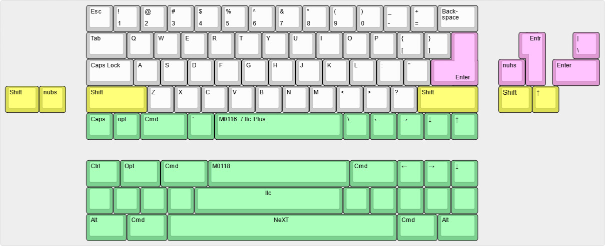
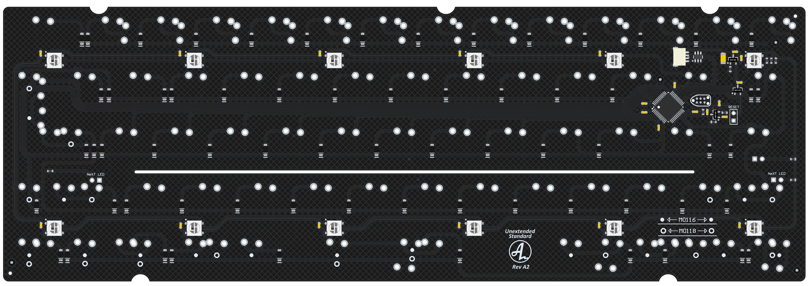

# Unextended Standard PCB

This PCB is for use with the Standard-edition (the slimmer one) of my Unextended design (https://github.com/4pplet/Unextended). This PCB will NOT fit a standard 60% case or the regular Unextended that is designed for use with AEK keycaps. This PCB is for use with Apple Standard Keyboard keycaps (M0118, M0116 or IIc).

## Status:
- Rev A1 prototypes tested and verified.
- Test fit using M0118 and M0116 keycaps done.

## Features:
- QMK & VIA
- RGB-underglow
- M0116, M0118 and IIc keycap support
- Daughter board only.

## Availability:
As an option to DIY, I'll try and keep these available for purchase here: https://4pplet.com/ For DIY, the production files are avaliable in releases.

## Layout support MX: 

## PCB View

## Releases
Files for manufacturing can be found in releases.

## Revision history:
- Rev A1: Initial prototype.
- Rev A2: Adding additional support for Apple Desktop Bus (ADB) Keyboard. Number row is rotated 90 degrees.

<a href='https://ko-fi.com/4pplet' target='_blank'>
